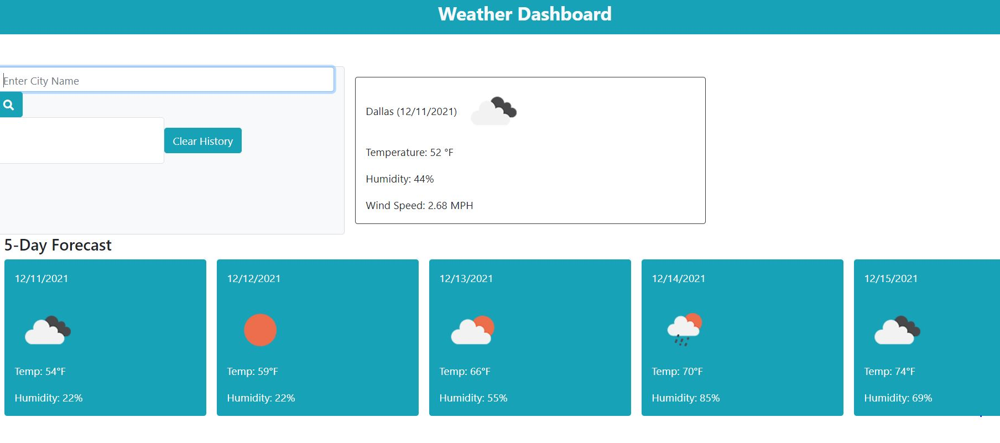
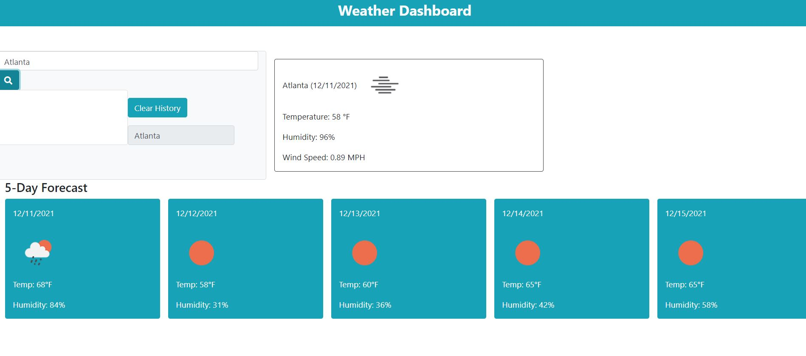
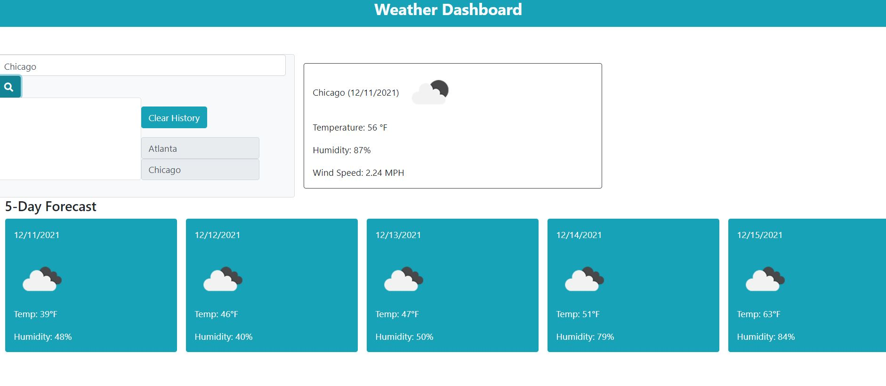
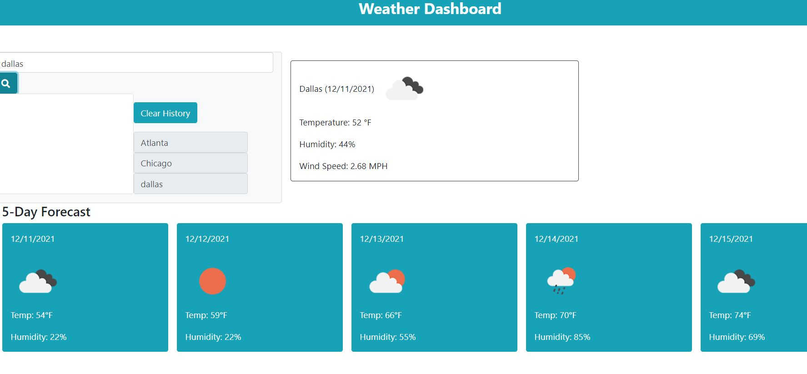

# Weather-Dashboard

## Description

This is a weather dashboard which allows the user to look up a city's weather forecast which ultimately will display the current weather and a 5-Day forecast. When the current forecast is retrieved, the user is given the temperature, humidity and wind speed. However, when given the 5-Day forecast, the user is given only the temperature and the humidity for those days. Weather icons are also added to give a visual aid for the weather data retrieved.

##  User Story

AS A traveler
I WANT to see the weather outlook for multiple cities
SO THAT I can plan a trip accordingly

## Acceptance Criteria

GIVEN a weather dashboard with form inputs
WHEN I search for a city
THEN I am presented with current and future conditions for that city and that city is added to the search history
WHEN I view current weather conditions for that city
THEN I am presented with the city name, the date, an icon representation of weather conditions, the temperature, the humidity, the wind speed, and the UV index
WHEN I view the UV index
THEN I am presented with a color that indicates whether the conditions are favorable, moderate, or severe
WHEN I view future weather conditions for that city
THEN I am presented with a 5-day forecast that displays the date, an icon representation of weather conditions, the temperature, the wind speed, and the humidity
WHEN I click on a city in the search history
THEN I am again presented with current and future conditions for that city

## Usage

This is a weather dashboard that gives the user the ability to check the weather for a city that the user inputs. The current weather will be given alongside the 5-day forecast. The user will be be able to view the list of previous cities searched and click on those previous searches in order to reminded of those cities forecast. The option to clear the search history is also given to the user to clear space.

## Screenshots

## 

